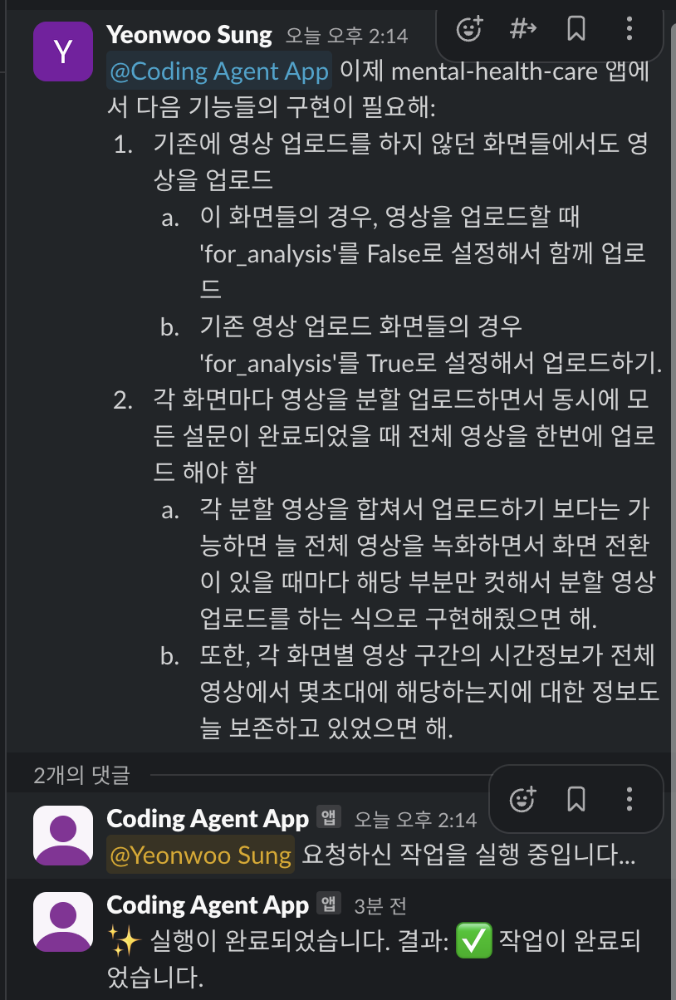
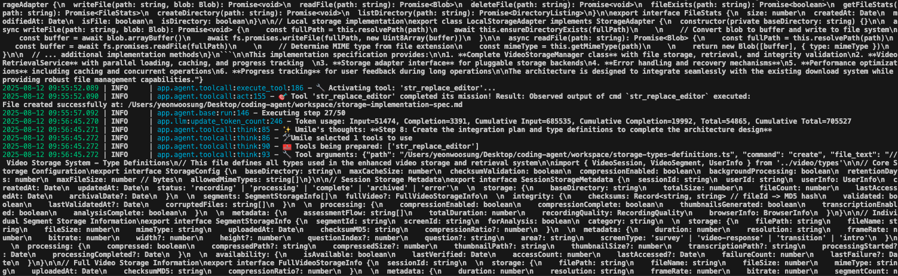

# Coding Agent

AI-agent for coding.




## Pre-requisite

First, create the config for LLM call.
```bash
cd config

cp config.example.toml config.toml
```

Then, update the config.toml with your LLM configs (i.e. OpenAI API key, etc).

Next, install the dependencies:
```bash
# Install dependencies
python3 -m pip install -r requirements.txt
```

### Additional requirements (for UI components)

Also, install `playwright` for UI component:
```bash
playwright install
```

## Running instructions

### CLI

```bash
python3 cli.py
```

### Slack-bot server

To run the slack-bot, please set up the dotenv file with slack-related variables.
Copy the `.env.template` file for the reference.

```bash
python3 slack_bot.py
```
